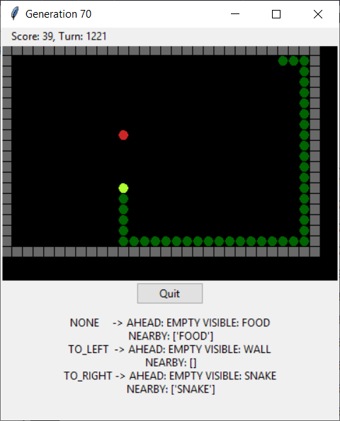
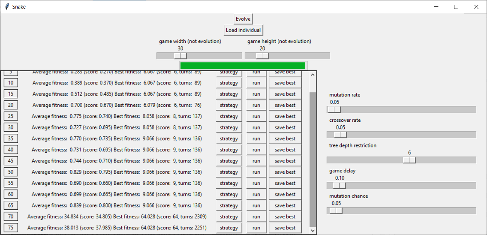

# Genetic Snake
Genetic algorithm framework for the game Snake. Provides GUI for configuration of genetic algorithm parameters, loading and saving models and watching the models play the game.




## How to run:
```$ python -m genetic_snake```

### Requirements:
- python 3.6+ (https://www.python.org/downloads/)
- tkinter (python 3 version) (sudo apt install python3-tk)

#### Note:
good.individual contains individual that can be loaded from the game interface

### Configuration:
Some variables ("constants") are not configurable from the GUI but can be easily modified in source files. Most of them are located in the tree.py file in Evolution class.

## Current state
- The framework is fully functional.
- Variable configuration could use some polish.
- Framework could be improved by increasing modularity and allowing different types of nodes ("behavior").

## Authors
Original project made as a semestral work for BI-ZUM at [FIT CTU](https://fit.cvut.cz/en).

### Made with / Thanks to
- Course materials for [BI-ZUM](https://courses.fit.cvut.cz/BI-ZUM/) - CTU students access only.
- [A Field Guide to Genetic Programming](http://www.gp-field-guide.org.uk/)
